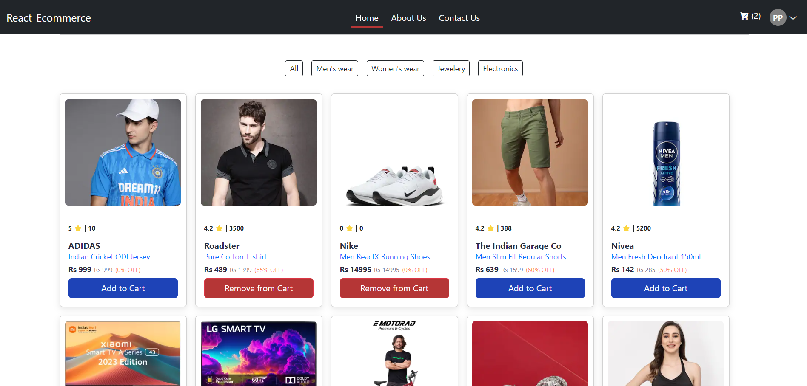

# React_ecommerce
React_ecommerce is an eCommerce application I created it includes sign-up, login, myCart and and fetch myCart data user-based. functionalities, all implemented using JSON REST API

# Technologies & Tools Used

* ReactJS
* HTML
* CSS
* Bootstrap
* VS Code
* Json REST api

# Installation and Usage
To use this app, you can follow these steps:

* Clone the repository or download the source code.
* Open the project in your preferred code editor.
* Run npm install to install the necessary dependencies.
* Run npx --watch json-server db.json to start the backend server.
* Run npm run dev to start the development server.
* Open your browser and navigate to http://localhost:5173 to use the app.

